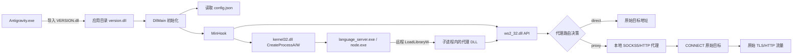
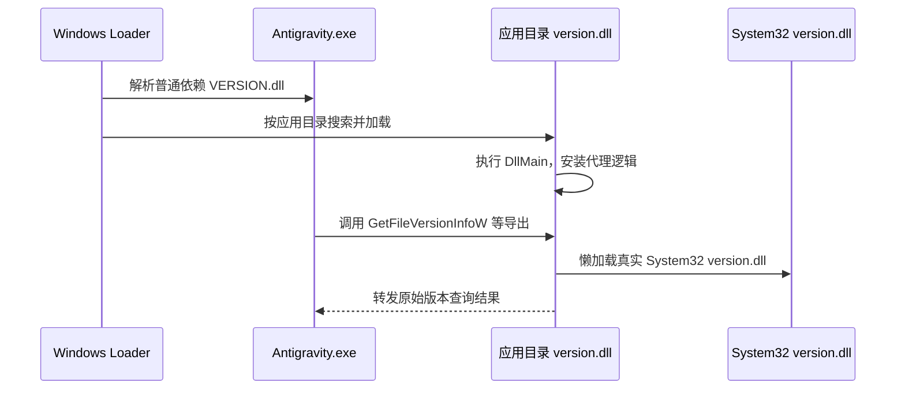
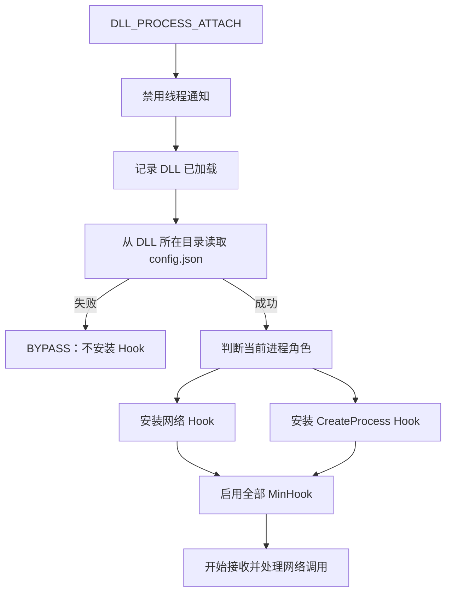
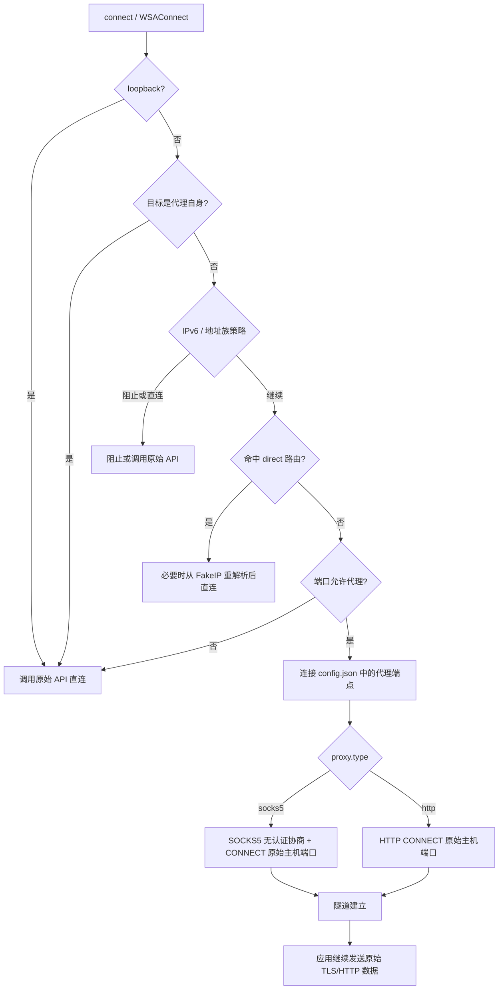
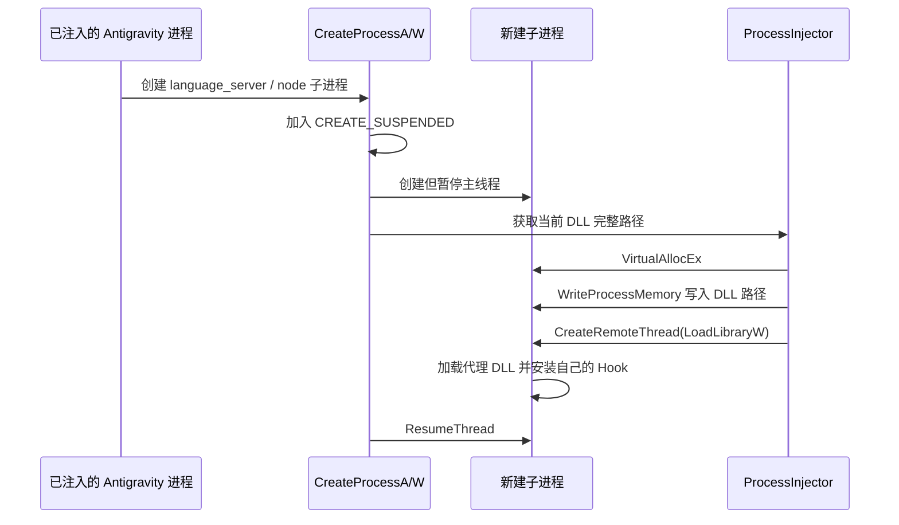

# Antigravity-Proxy 技术方案

## 1. 方案结论

Antigravity-Proxy 是一个基于 Windows DLL 劫持、MinHook API Hook 和进程注入的进程级透明代理方案。

它解决的是 Antigravity 不主动使用系统代理的问题，但它本身并不读取或修改 Windows 的 WinINET 代理设置，也不依赖 `HTTP_PROXY`、`HTTPS_PROXY` 等环境变量。Antigravity 的业务流量最终走哪里，取决于 DLL 所在目录中的 `config.json`：

```text
Antigravity 业务请求
        |
        v
目标进程内的 Winsock API
        |
        v
Antigravity-Proxy Hook
        |
        +-- 直连：localhost、内网、未命中代理规则的目标
        |
        +-- 代理：连接本地 SOCKS5/HTTP 代理并建立目标隧道
```

当前方案的核心目标是只接管 Antigravity 及其相关子进程，不开启 TUN，也不改变其他普通进程的网络路径。

## 2. 总体架构



主要模块：

| 模块 | 作用 |
| --- | --- |
| `src/proxy/VersionProxy.cpp` | 伪装为 `version.dll`，转发真实版本查询函数 |
| `src/main.cpp` | DLL 入口、配置加载、Hook 初始化与卸载 |
| `src/hooks/Hooks.cpp` | Winsock、异步连接、流量和子进程 Hook |
| `src/core/Config.hpp` | 加载并校验 `config.json` |
| `src/network/Socks5.hpp` | SOCKS5 握手和 TCP CONNECT |
| `src/network/HttpConnect.hpp` | HTTP CONNECT 隧道 |
| `src/network/FakeIP.hpp` | 域名到 FakeIP 的映射 |
| `src/injection/ProcessInjector.hpp` | 向新建子进程注入 DLL |
| `src/proxy/DbgHelpShim.cpp` | Antigravity CLI 的 `dbghelp.dll` 兼容层 |

## 3. DLL 加载入口

### 3.1 为什么 Antigravity 会加载 `version.dll`

当前 Antigravity 主程序的 PE 导入表中直接包含：

```text
VERSION.dll
```

导入的函数包括：

```text
GetFileVersionInfoSizeW
GetFileVersionInfoW
VerQueryValueW
```

这些函数通常用于读取文件版本信息。Windows 在启动进程、解析普通 DLL 依赖时，会根据 DLL 名称搜索对应文件。原始安装目录没有本地 `version.dll` 时，系统会继续加载：

```text
C:\Windows\System32\version.dll
```

把项目生成的同名 DLL 放到 Antigravity 主程序目录后，Windows 会优先命中应用目录中的文件：



项目不是修改 Antigravity 的导入表，也不是由单独启动器主动调用 `LoadLibrary("version.dll")`。它利用的是 Windows 对未指定完整路径的 DLL 依赖解析和同名 DLL 覆盖行为。

### 3.2 导出转发

本地 `version.dll` 如果不提供 Antigravity 需要的导出函数，进程会启动失败或在调用时崩溃。因此项目使用 `src/proxy/version.def` 导出版本 API，并在第一次导出函数被调用时：

1. 拼出 `System32\version.dll` 的绝对路径；
2. 使用 `LoadLibraryW` 加载系统原版；
3. 使用 `GetProcAddress` 获取真实函数地址；
4. 把调用参数和返回值转发给系统 DLL。

`VersionProxy::Initialize()` 本身保持为空操作，避免在 `DllMain` 期间立即加载另一个 DLL，降低 Loader Lock 风险。

相关代码：

- `src/main.cpp:240`：DLL 入口；
- `src/proxy/VersionProxy.cpp:68`：真实 `version.dll` 懒加载；
- `src/proxy/version.def`：导出函数列表。

## 4. 初始化与 Hook 安装

DLL 被加载后，`DllMain` 执行以下流程：



配置文件优先从 DLL 自身目录读取，而不是依赖当前工作目录。这是为了兼容 Antigravity 的子进程工作目录变化。

当配置加载失败时，项目进入 BYPASS 模式，不安装网络 Hook，避免错误配置导致目标进程所有网络连接被破坏。

## 5. TCP 代理路径

### 5.1 被拦截的 API

项目使用 MinHook 拦截以下网络入口：

- `socket`、`WSASocketA/W`；
- `connect`、`WSAConnect`；
- `WSAConnectByNameA/W`；
- `WSAIoctl` 获取并 Hook `ConnectEx`；
- `getaddrinfo`、`GetAddrInfoW`、`gethostbyname`；
- `send`、`recv`、`WSASend`、`WSARecv`；
- `sendto`、`recvfrom`、`WSASendTo`、`WSARecvFrom`；
- `WSAGetOverlappedResult` 和 IOCP 完成通知 API。

Hook 安装集中在 `src/hooks/Hooks.cpp` 的 `Hooks::Install()`。

### 5.2 连接决策

TCP 连接进入 `PerformProxyConnect()` 后，主要按以下顺序处理：



代理连接并不是让应用把目标地址改成代理地址后直接发送 HTTP 数据。项目在底层先连接代理，再完成协议握手：

- SOCKS5：发送无认证方法协商，然后发送 `CONNECT` 请求；
- HTTP：发送 `CONNECT host:port HTTP/1.1`，等待 `200`；
- 隧道建立后，应用自己的 TLS 握手和上层协议保持不变。

因此 Antigravity 不需要知道代理的存在，也不需要修改其 HTTP 客户端配置。

### 5.3 代理规则

默认构建配置中的主要策略如下：

| 配置 | 默认值 | 含义 |
| --- | --- | --- |
| `proxy.host` | `127.0.0.1` | 本地代理监听地址 |
| `proxy.port` | `7890` | 本地代理监听端口 |
| `proxy.type` | `socks5` | `socks5` 或 `http` |
| `allowed_ports` | `[80, 443]` | 默认只代理 HTTP/HTTPS 端口 |
| `dns_mode` | `direct` | DNS 端口默认直连 |
| `ipv6_mode` | `proxy` | IPv6 默认进入代理决策 |
| `udp_mode` | `auto` | SOCKS5 时尝试 UDP Associate |
| `udp_fallback` | `block` | UDP 代理失败时默认阻断，避免泄漏 |
| `routing.default_action` | `proxy` | 未命中规则时默认代理 |
| `use_default_private` | `true` | 回环和常见内网地址默认直连 |

路由规则支持域名、IPv4/IPv6 CIDR、端口范围和协议条件，可以对单个目标选择 `proxy` 或 `direct`。

## 6. FakeIP 与域名解析

### 6.1 设计目的

如果本地 DNS 无法解析目标域名，或者希望让 SOCKS5 代理端解析域名，项目会 Hook DNS API，把域名转换为虚拟地址：

```text
daily-cloudcode-pa.googleapis.com
        ↓
198.18.x.x
```

默认 FakeIP 网段是 `198.18.0.0/15`。

### 6.2 连接时恢复域名

项目维护两类映射：

```text
域名  -> FakeIP
FakeIP -> 域名
```

当应用随后连接 `198.18.x.x:443` 时，Hook 从映射表恢复原始域名，再向 SOCKS5 代理发送：

```text
CONNECT daily-cloudcode-pa.googleapis.com:443
```

映射还通过命名共享内存和互斥体在多个相关进程之间尽力共享，以降低主进程解析、子进程连接时出现映射缺失的概率。

如果路由规则要求直连，而目标仍是 FakeIP，项目会尝试重新解析真实地址后直连，避免把虚拟地址直接发到网络上。

相关代码：

- `src/hooks/Hooks.cpp:2842`：DNS API Hook；
- `src/hooks/Hooks.cpp:908`：连接目标还原；
- `src/network/FakeIP.hpp`：映射分配、查询和跨进程共享。

## 7. 子进程注入

Antigravity 的真正业务请求可能由语言服务器或 Node 子进程发起，仅 Hook 主进程是不够的。因此项目还 Hook `CreateProcessW` 和 `CreateProcessA`。

流程如下：



注入器使用的标准远程线程步骤是：

1. `VirtualAllocEx` 在目标进程分配内存；
2. `WriteProcessMemory` 写入 DLL 路径；
3. 获取 `LoadLibraryW` 地址；
4. `CreateRemoteThread` 调用目标进程中的 `LoadLibraryW`；
5. 等待远程线程结束并恢复子进程。

默认 `target_processes` 覆盖：

```text
agy.exe
language_server.exe
language_server_windows
Antigravity.exe
Antigravity IDE.exe
node.exe
```

支持两种注入模式：

- `filtered`：只注入目标列表中的子进程；
- `inherit`：注入所有新建子进程，再通过 `child_injection_exclude` 排除不应注入的进程。

当前代码还对 `language_server* -> node.exe` 做了兼容性自动注入，以覆盖新版 Antigravity 的对话执行链路。

## 8. ConnectEx、IOCP 和 UDP

### 8.1 异步 TCP

现代 Chromium、Rust、Go 或 Node 网络代码可能不调用同步 `connect`，而是通过 `ConnectEx` 和 IOCP。

项目因此：

1. Hook `WSAIoctl`；
2. 捕获 `SIO_GET_EXTENSION_FUNCTION_POINTER + WSAID_CONNECTEX`；
3. 对每个 Winsock Provider 安装 `ConnectEx` Hook；
4. 记录 `OVERLAPPED` 上下文；
5. 在 `WSAGetOverlappedResult`、`GetQueuedCompletionStatus` 或 `GetQueuedCompletionStatusEx` 中完成代理握手。

这样可以在异步连接完成后，补做 SOCKS5/HTTP CONNECT 握手，同时保持应用原有的异步调用语义。

### 8.2 UDP/QUIC

UDP 默认策略为 `auto`：

- 使用 SOCKS5 时，尝试建立 UDP Associate；
- 将应用 UDP 数据封装为 SOCKS5 UDP Request；
- 从 SOCKS5 UDP Reply 中去除协议头，再交给应用；
- HTTP 代理不支持该 UDP 路径时，按 `udp_fallback` 处理。

如果策略为 `block`，项目会阻止非回环、非 DNS 的 UDP，目的是避免 QUIC/HTTP3 绕过 TCP 代理形成流量泄漏。

## 9. CLI 方案

桌面端使用：

```text
version.dll + config.json
```

Antigravity CLI 使用：

```text
dbghelp.dll + antigravity_proxy.dll + config.json
```

CLI 的原因是 `version.dll` 可能已经被 CLI 或系统模块加载，继续使用同名 DLL 容易产生模块冲突。因此 `dbghelp.dll` 作为 shim：

1. 转发常用 DbgHelp 导出到 `System32\dbghelp.dll`；
2. 识别当前进程是否为 `agy.exe` 或 `antigravity-cli.exe`；
3. 延迟加载同目录的唯一名称 `antigravity_proxy.dll`；
4. 由后者安装网络 Hook。

相关代码：

- `src/proxy/DbgHelpShim.cpp`；
- `src/proxy/dbghelp.def`；
- `CMakeLists.txt:119`。

## 10. 与 Windows 系统代理的关系

需要区分以下两条链路：

| 场景 | 使用的代理来源 |
| --- | --- |
| Antigravity 业务网络 | DLL 所在目录的 `config.json` |
| 安装器下载 GitHub Release | .NET `HttpClientHandler.UseProxy = true`，使用 Windows/当前环境代理 |
| 可选更新检查 | WinHTTP `WINHTTP_ACCESS_TYPE_AUTOMATIC_PROXY` |
| WSL 内部 Linux 进程 | 不受本项目 Windows DLL Hook 影响 |

因此，如果用户把 Clash/Mihomo 的本地监听端口称为“系统代理端口”，项目可以配置成使用同一个端口；但项目不会自动同步系统代理端口。系统代理改端口后，`config.json` 也需要相应修改。

## 11. 部署与验证

### 11.1 桌面端部署

将同一构建、同一架构生成的文件复制到与 `Antigravity.exe` 同目录：

```text
Antigravity/
├── Antigravity.exe
├── version.dll
└── config.json
```

必须匹配目标程序的 x86/x64 架构。Antigravity 更新后如果清理安装目录中的 DLL，需要重新部署。

### 11.2 依赖验证

检查主程序是否依赖 `version.dll`：

```powershell
dumpbin /dependents Antigravity.exe | findstr /i version.dll
```

检查具体导入函数：

```powershell
dumpbin /imports Antigravity.exe | findstr /i "VERSION.dll GetFileVersion VerQuery"
```

检查实际加载路径，可以使用 Process Explorer，或者通过 PowerShell 读取进程模块列表。期望看到的是：

```text
<Antigravity安装目录>\version.dll
```

而不是：

```text
C:\Windows\System32\version.dll
```

### 11.3 日志验证

重点日志通常位于：

```text
<Antigravity安装目录>\logs\proxy-YYYYMMDD.log
%TEMP%\antigravity-proxy-logs\proxy-YYYYMMDD.log
```

典型成功证据包括：

```text
Antigravity-Proxy DLL 已加载
配置加载成功
所有 API Hook 安装成功
[成功] 已注入新建进程
代理隧道就绪
```

如果需要排查连接目标、路由、FakeIP 或异步连接，应将 `log_level` 改为 `debug`。

## 12. 限制与风险

1. **只覆盖 Windows PE 进程。** WSL 内部的 Linux 语言服务器和 Linux 网络调用不经过本 DLL。
2. **需要架构匹配。** x64 程序不能使用 x86 DLL，反之亦然。
3. **代理协议能力有限。** 当前 SOCKS5 握手使用无认证方式；HTTP 代理使用基本 CONNECT，不包含代理认证头。
4. **并非所有网络路径都能捕获。** 直接系统调用、未覆盖的第三方网络 Provider 或绕过 Winsock 的实现可能不经过这些 Hook。
5. **DLL 劫持有供应链和安全风险。** 只有在确认 DLL 来源可信时，才应把同名 DLL 放入应用目录；部署前应检查架构、哈希和导出函数。
6. **应用更新可能覆盖部署。** Antigravity 版本更新、启动目录变化或多安装目录都可能导致代理 DLL 未被加载。
7. **出口 IP 仍会影响服务端策略。** DLL 和代理握手成功不代表 Antigravity Agent 服务一定接受该代理出口，`location`、ASN 或机房 IP 仍可能被服务端拒绝。

## 13. 关键源码索引

| 主题 | 文件 |
| --- | --- |
| DLL 入口与初始化 | `src/main.cpp` |
| `version.dll` 转发 | `src/proxy/VersionProxy.cpp`、`src/proxy/version.def` |
| 网络和进程 Hook | `src/hooks/Hooks.cpp` |
| 配置解析 | `src/core/Config.hpp` |
| SOCKS5 | `src/network/Socks5.hpp` |
| HTTP CONNECT | `src/network/HttpConnect.hpp` |
| FakeIP | `src/network/FakeIP.hpp` |
| 子进程注入 | `src/injection/ProcessInjector.hpp` |
| CLI shim | `src/proxy/DbgHelpShim.cpp`、`src/proxy/dbghelp.def` |
| 构建和默认配置 | `CMakeLists.txt`、`build.ps1` |

